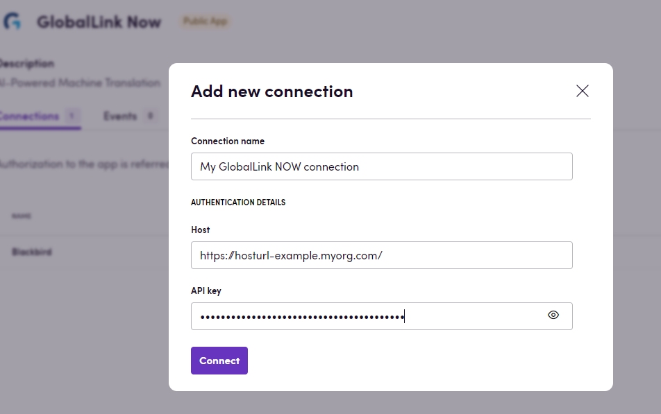
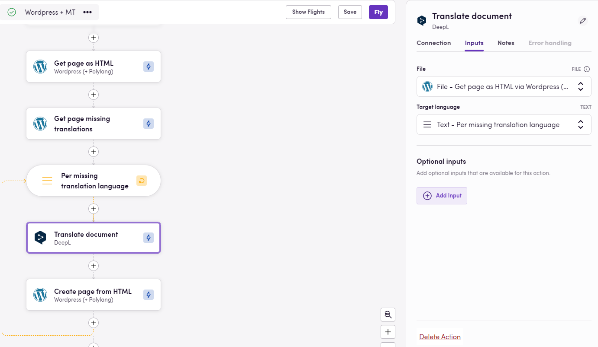

# Blackbird.io GlobalLink Now

Blackbird is the new automation backbone for the language technology industry. Blackbird provides enterprise-scale automation and orchestration with a simple no-code/low-code platform. Blackbird enables ambitious organizations to identify, vet and automate as many processes as possible. Not just localization workflows, but any business and IT process. This repository represents an application that is deployable on Blackbird and usable inside the workflow editor.

## Introduction

<!-- begin docs -->

 GlobalLink NOW is an ad-hoc Neural Machine Translation solution that leverages AI technology to securely deliver high-quality content on demand.
 
## Before setting up

Before you can connect you need to make sure that:

- You have a GlobalLink NOW instance.
- You have HOST and Api key data for your GlobalLink NOW instance.

## Connecting

1. Navigate to apps and search for GlobalLink NOW. If you cannot find GlobalLink NOW then click _Add App_ in the top right corner, select GlobalLink NOW and add the app to your Blackbird environment.
2. Click _Add Connection_.
3. Name your connection for future reference e.g. 'My connection'.
4. Fill in the Host of your GlobalLink NOW instance.
5. Fill in the Api key to your GlobalLink NOW instance..
6. Click _Connect_.

## Actions

- **Translate** Translate text
- **Translate Document** Translate a file. 
Input:
    - File
    - Target Language
    - Source Language (optional)
    - Domain (optional)
    - Engine ID (optional)
    - OCR (optional)

## Example

The bird in the image below portrays a workflow in which content is extracted from a Wordpress page in HTML format, as well as all the locales that do not have a translation for this specific page. Then we iterate through the locales, translate the HTML file into each locale using GlobalLink NOW and create the translation pages in Wordpress from the translated HTML files.

## Feedback

Do you want to use this app or do you have feedback on our implementation? Reach out to us using the [established channels](https://www.blackbird.io/) or create an issue.

<!-- end docs -->
